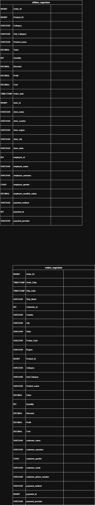
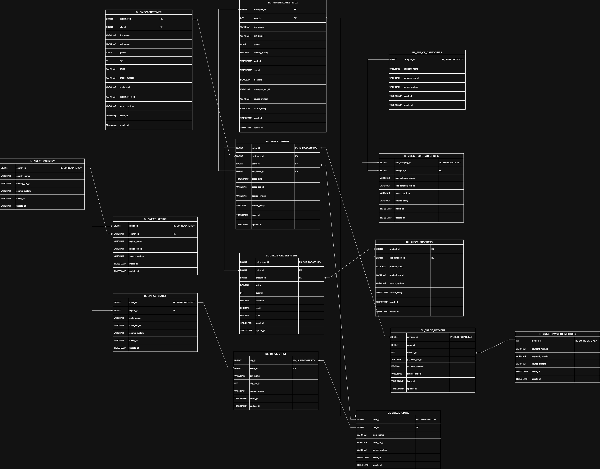
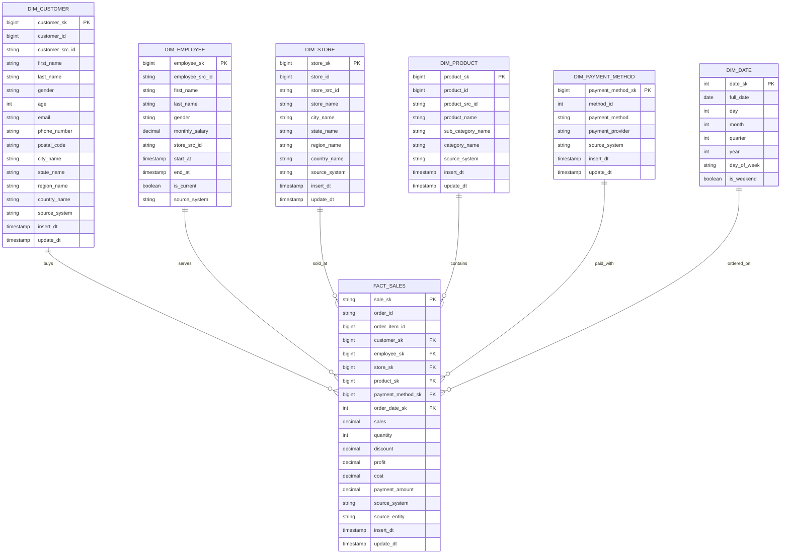

# Super Store Declarative Pipeline — Online / Offline Sales DWH

An end-to-end Data Engineering pipeline that ingests raw online and offline
sales data from AWS S3, harmonizes it into a 3NF Silver model, and finally
exposes a denormalized Star Schema on the Gold layer for sales analytics.
The pipeline is implemented on **Databricks** with
`pyspark.pipelines as dp` (Declarative Pipelines / DLT), PySpark and Delta
Lake, and follows the **Medallion architecture** (Bronze → Silver → Gold).

---

## Medallion Architecture & Data Flow

```
           +----------------+       +----------------+       +----------------+
 S3 CSVs → |     BRONZE     |  -->  |     SILVER     |  -->  |      GOLD      |
           |  raw ingestion |       |   3NF model    |       |  star schema   |
           |  (Auto Loader) |       | (harmonization)|       | (analytics)    |
           +----------------+       +----------------+       +----------------+
```

### Bronze — raw ingestion

Two independent streams materialized as Delta tables with Change Data Feed
enabled. Both use Databricks Auto Loader (`cloudFiles`) in `PERMISSIVE` mode
with schema evolution (`rescue`).

| Table                              | Source                                                | Purpose                         |
| ---------------------------------- | ----------------------------------------------------- | ------------------------------- |
| `transportation.bronze.online_bronze`  | `s3://databricks-project-bucket-1/data-store/online`  | E-commerce orders (customer-rich) |
| `transportation.bronze.offline_bronze` | `s3://databricks-project-bucket-1/data-store/offline` | Physical-store orders (staff, store-rich) |

Bronze schemas (drawio):



### Silver — 3NF harmonized model

Bronze rows are unified via `unionByName`, tagged with a `source_system`
column (`online`, `offline`, or `online and offline` for dictionaries that
exist in both sources), deduplicated, and split into normal-form entities
with deterministic natural keys stored in `*_src_id` columns.

Silver tables:

| Table | Type | Notes |
| ----- | ---- | ----- |
| `BL_3NF_CE_CATEGORIES`      | dim (dict)  | deduped category dictionary |
| `BL_3NF_CE_SUB_CATEGORIES`  | dim (dict)  | FK → CATEGORIES |
| `BL_3NF_CE_PRODUCTS`        | dim (dict)  | FK → SUB_CATEGORIES |
| `BL_3NF_CE_COUNTRY`         | dim (dict)  | country-name harmonization (USA → United States, UK → United Kingdom) |
| `BL_3NF_CE_REGION`          | dim (dict)  | FK → COUNTRY |
| `BL_3NF_CE_STATE`           | dim (dict)  | FK → REGION |
| `BL_3NF_CE_CITY`            | dim (dict)  | FK → STATE |
| `BL_3NF_CE_STORE`           | dim         | FK → CITY (offline only) |
| `BL_3NF_CE_CUSTOMER`        | **SCD1**    | online only, deduped by email |
| `BL_3NF_CE_PAYMENT_METHODS` | dim (dict)  | merged dictionary from both sources |
| `BL_3NF_EMPLOYEE_SCD2`      | **SCD2**    | `dp.create_streaming_table` + `dp.create_auto_cdc_flow`, `stored_as_scd_type=2` |
| `BL_3NF_CE_ORDERS`          | streaming fact | header grain, watermarked + deduped |
| `BL_3NF_CE_ORDERS_ITEMS`    | streaming bridge | one row per bronze line item |
| `BL_3NF_CE_PAYMENT`         | streaming fact | links orders to payment methods |

Silver schema:



### Gold — Star Schema for sales analytics

The highly normalized Silver geography chain
`COUNTRY → REGION → STATE → CITY → STORE` and the product chain
`CATEGORIES → SUB_CATEGORIES → PRODUCTS` are collapsed into flat dimensions
(`DIM_STORE`, `DIM_PRODUCT`). The central fact is `FACT_SALES` at
order-line-item grain.

Gold tables:

| Table | Role | Notes |
| ----- | ---- | ----- |
| `FACT_SALES`         | fact       | PK `sale_sk = MD5(order_src_id || product_id)` |
| `DIM_CUSTOMER`       | SCD1 dim   | flat customer + geography |
| `DIM_EMPLOYEE`       | SCD2 dim   | preserves `start_at` / `end_at` / `is_current` |
| `DIM_STORE`          | dim        | flat store + city + state + region + country |
| `DIM_PRODUCT`        | dim        | flat product + sub-category + category |
| `DIM_PAYMENT_METHOD` | dim        | passthrough of the silver dictionary |
| `DIM_DATE`           | dim        | generated from `min/max(order_date)` |

---

## Design Decisions

### 1. 3NF on Silver with online / offline union

Every Silver entity follows the same harmonization pattern:

```python
df_combined = df_online.unionByName(df_offline)

df_merged = (
    df_combined.groupBy(<natural_key_cols>)
    .agg(F.collect_set("source_system").alias("systems_array"))
    .withColumn(
        "source_system",
        F.when(F.size("systems_array") == 2, F.lit("online and offline"))
         .otherwise(F.element_at("systems_array", 1))
    )
)
```

Dictionary rows that appear in both sources are labeled
`"online and offline"` instead of duplicated.

### 2. Deterministic MD5 natural keys (`*_src_id`)

Every Silver entity carries a deterministic hash so it is idempotent across
re-runs, while the technical PK is a surrogate `BIGINT`:

```python
.withColumn("order_src_id", F.md5(F.concat(F.col("source_system"), F.col("order_src_id_raw"))))
.withColumn("order_id", F.monotonically_increasing_id())
```

Downstream joins (Silver → Silver, Silver → Gold) use these deterministic
`*_src_id` / surrogate pairs as lookup keys, which makes the whole pipeline
replayable without producing duplicates.

### 3. SCD1 for `BL_3NF_CE_CUSTOMER`

Customers only exist in the online source and are deduplicated by email
(`dropDuplicates(["email"])`). A full refresh of the table overwrites old
attribute values — no history is kept.

### 4. SCD2 for `BL_3NF_EMPLOYEE_SCD2`

Employees (offline source) are tracked historically via Declarative
Pipelines' native CDC machinery:

```python
dp.create_streaming_table(name="transportation.silver.BL_3NF_EMPLOYEE_SCD2", schema="...")

@dp.temporary_view()
def employee_changes():
    ...

dp.create_auto_cdc_flow(
    target="transportation.silver.BL_3NF_EMPLOYEE_SCD2",
    source="employee_changes",
    keys=["employee_src_id"],
    sequence_by=F.col("update_dt"),
    except_column_list=["insert_dt"],
    stored_as_scd_type=2,
)
```

Each versioned row carries `__START_AT` / `__END_AT`; the Gold
`DIM_EMPLOYEE` promotes those to `start_at` / `end_at` and adds an
`is_current` flag for convenience.

### 5. Star Schema on Gold

- Denormalized geography (`DIM_STORE`) and product hierarchy (`DIM_PRODUCT`)
  to minimize joins in BI queries.
- `FACT_SALES` grain = one order line item. The deterministic fact PK
  `sale_sk = MD5(order_src_id || product_id)` makes the fact stable and
  replayable.
- Because Silver `BL_3NF_CE_PAYMENT` is append-only at line grain, the fact
  collapses it to one payment per order (`row_number()` over
  `order_id ORDER BY payment_id`) to avoid fan-out on payment metrics.

---

## Gold ERD



---

## Project Structure

```
Declarative_Pipeline_super_store/
├── ETL_PIPELINE_ONLINE_OFFLINE_SALES/
│   ├── explorations/
│   │   └── eda.py
│   └── transformations/
│       ├── bronze/
│       │   ├── online_ingestion.py
│       │   └── offline_ingestion.py
│       ├── silver/
│       │   └── transformation_3nf.py
│       └── gold/
│           └── star_schema.py
├── schemas/
│   ├── bronze_layer.drawio.png
│   └── silver_layer.png
├── manifest.mf
└── README.md
```

---

## Tech Stack

- **Databricks Declarative Pipelines** (`pyspark.pipelines as dp`) with
  `@dp.table`, `@dp.temporary_view`, `dp.create_streaming_table`,
  `dp.create_auto_cdc_flow`.
- **PySpark** (batch + Structured Streaming) with
  `spark.readStream` / `spark.read`.
- **Delta Lake** with Change Data Feed and `autoOptimize.optimizeWrite`.
- **Databricks Auto Loader** (`cloudFiles`, CSV, `rescue` schema
  evolution, `PERMISSIVE` mode).
- **AWS S3** as the landing zone for raw CSV files.
- **Unity Catalog** layout `transportation.{bronze, silver, gold}`.
- **Mermaid.js** for in-repo ERD documentation.

---

## How to Run on Databricks

1. Create (or reuse) a Unity Catalog catalog named `transportation` with
   schemas `bronze`, `silver`, `gold`.
2. Upload raw CSVs to:
   - `s3://databricks-project-bucket-1/data-store/online/`
   - `s3://databricks-project-bucket-1/data-store/offline/`
3. Create a **Declarative Pipeline** whose source includes all three
   transformation folders:
   - [`ETL_PIPELINE_ONLINE_OFFLINE_SALES/transformations/bronze`](ETL_PIPELINE_ONLINE_OFFLINE_SALES/transformations/bronze)
   - [`ETL_PIPELINE_ONLINE_OFFLINE_SALES/transformations/silver`](ETL_PIPELINE_ONLINE_OFFLINE_SALES/transformations/silver)
   - [`ETL_PIPELINE_ONLINE_OFFLINE_SALES/transformations/gold`](ETL_PIPELINE_ONLINE_OFFLINE_SALES/transformations/gold)
4. Set the pipeline's target catalog to `transportation` (schemas are
   referenced explicitly in each table name).
5. Trigger a **Full Refresh** for the first run so that Silver dictionaries
   are seeded before the Silver facts and before the Gold layer reads
   them.
6. Subsequent runs can be **Triggered** or **Continuous**; Bronze and the
   Silver fact tables are streaming, the rest are rebuilt incrementally.

---

## Dependency Notes

- `order_id` / `order_item_id` / `payment_id` use `monotonically_increasing_id()`
  BIGINT surrogates; the deterministic MD5 hash lives in the companion
  `*_src_id` STRING column. This matches the Silver schema types while
  still guaranteeing replay-safe joins through the `*_src_id` keys.
- `BL_3NF_EMPLOYEE_SCD2` does not hold a BIGINT surrogate, so
  `BL_3NF_CE_ORDERS` and the Gold fact join to it via `employee_src_id`.
